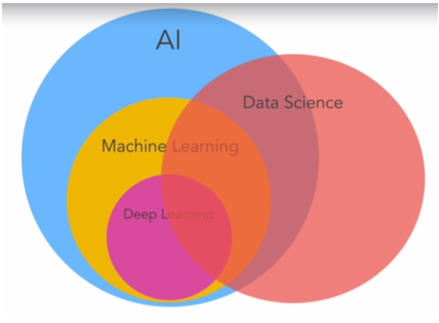

    <h1> Fundamentals Concepts of Machine Learning </h1>

***

# Introduction
The purpose of this document is to enlist some of the fundamental concepts of machine learning to understand what happens when ML algorithms are being trained and used. 
***
# What is Machine Learning?

Machine learning is a programming field that studies how computers can learn things without explicitly programming them. It brings them the ability to do things that only humans can.

ML is a subset of AI that intends to allow computers to do things like humans. It currently belongs to the narrow AI, which means that computers can learn and perform one task well but can have multiple abilities as humans do. It tries this by finding patterns in a set of data. Then it is deep learning, which is a subfield of ML that uses neural networks to model data. ML overlaps with data science because it is needed to understand the data and how to work with it to train and make use of ML models.

Like every technology, ML appears because a business need of using large amounts of data they collect to find patterns that improve the business or solve problems they have.

## Types of Machine Learning

There are two main categories of ML, the first one is called supervised learning which consists essentially in give input of data labeled so the computer can figure out patterns to get that label. The second one is called unsupervised learning, in it the computer has to figure out the groups or categories cause the data isn't labeled. And there is a third one called reinforcement learning in which the computer learns by trial and error.

***
In a nutshell, ML is about asking the computer
to do something without giving instructions on how to do it. It has to figure out by finding patterns in the input data they receive.

# References
+ [TensorFlow Developer Certificate in 2023: Zero to Mastery](https://www.udemy.com/course/tensorflow-developer-certificate-machine-learning-zero-to-mastery/)

